# Hi there, I'm Kota Takeishi 👋

  
  

### I'm a student at Kyushu University and belong to [LIMU](https://limu.ait.kyushu-u.ac.jp/).

## Portfolio

  

## Stats

  
  

## Skills

### Frontend

### Backend

### Other Skills

